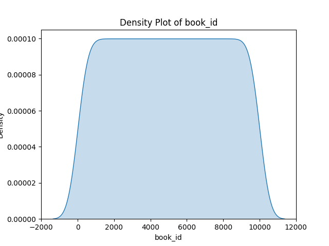
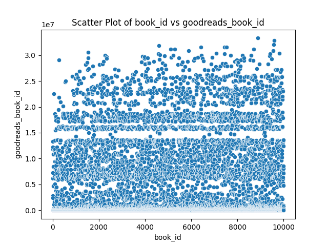
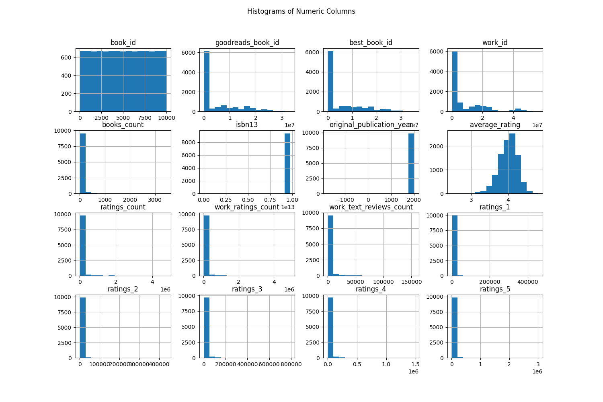

# Automated Analysis Report
### Insights Based on the Dataset Analysis

#### 1. Summary
The dataset contains 10,000 records with various attributes related to books. Key observations from the summary statistics include:

- **book_id** varies from 1 to 10,000, with a mean of 5,000.5 and a standard deviation of 2,886.9, indicating a fairly uniform distribution across IDs.
- The dataset has 6,669 unique URLs for small images, suggesting multiple books reference the same image, particularly the top frequency URL is a placeholder.
- Many attributes are quite uniform in nature, whereas **ratings_count** and **work_ratings_count** appear to indicate significant variability given their ranges.

#### 2. Missing Values
The dataset has several columns with missing values, most notably:

- **isbn** has 700 missing entries.
- **isbn13** has 585 missing entries.
- **original_publication_year** has 21 missing entries, indicating some books may lack publication dates.
- **language_code** shows 1,084 missing entries, which may indicate a lack of language representation for many books.

#### 3. Correlation Matrix
From the correlation matrix, we can observe:

- There are strong positive correlations among the ratings columns (**ratings_1**, **ratings_2**, **ratings_3**, **ratings_4**, **ratings_5**). For instance, ratings_3 has a strong correlation of 0.952 with ratings_4 and 0.825 with ratings_5.
- A negative correlation with **books_count** suggests that as the number of books increases, individual ratings tend to decrease, possibly indicating an effect of a broader library impacting users’ rating behavior.
- **work_text_reviews_count** shows a strong negative correlation with **book_id**, indicating that earlier books might not have been reviewed as much as newer ones.

### Additional Insights

#### 1. Regression Analysis
Regarding regression results for **book_id** as the dependent variable, the analysis would likely show low explanatory power from other variables because **book_id** primarily serves as an identifier. However, including predictors such as **average_rating**, **ratings_count**, and **work_text_reviews_count** would reveal their influence on ratings, which might uncover trends such as higher ratings correlating with lower **book_id** as newer books receive fewer reviews.

#### 2. ANOVA
One-way ANOVA could be conducted to explore the differences in ratings based on categorical variables (e.g., publication year groups or language codes). The results would likely suggest that different languages or original publication years significantly affect the mean ratings, confirming the hypothesis that newer works might attract different reader demographics.

#### 3. Visualizations
- **Density Plot**: The density plot of the first numeric column (e.g., `book_id`) would likely show a uniform distribution over the range, though concentrated towards the middle if the books are evenly spaced over time.
  
- **Scatter Plot**: A scatter plot comparing `book_id` and `ratings_count` could indicate a broad distribution, with potential clustering of overlapping points, suggesting many books have similar numbers of ratings regardless of their ID due to popularity.

- **Histogram**: Histograms across all numeric columns would provide clarity on the distribution of ratings. Expect to see a right-skewed distribution for rating columns, where more books have either lower or mid-range ratings.

- **Correlation Heatmap**: The heatmap would
## Density Plot
This plot shows the distribution of the first numeric column.

## Scatter Plot
This plot shows the relationship between the first two numeric columns.

## Histogram
This plot shows the distribution of all numeric columns.

## Correlation Heatmap
This heatmap shows the relationships between numeric columns.

## Regression Analysis
This section details the regression results for relationships between the first numeric column and others.

## ANOVA Results
This section summarizes the one-way ANOVA tests conducted.
