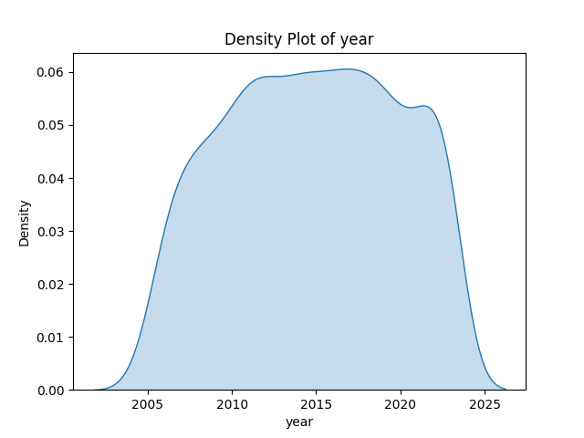
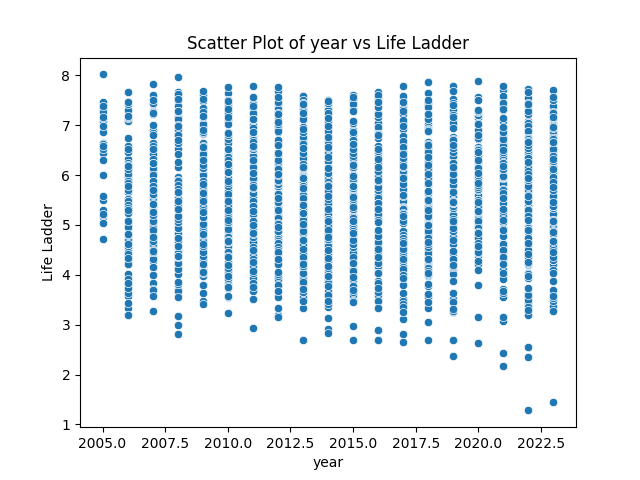
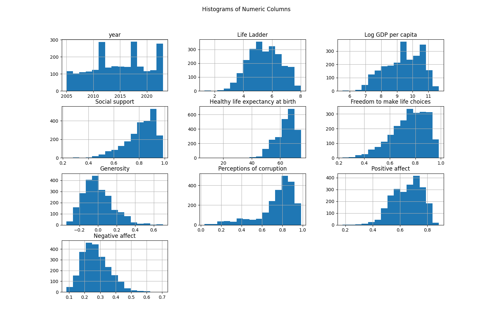

# Automated Analysis Report
### Dataset Summary

The dataset consists of 2363 entries across several countries, spanning from the year 2005 to 2023. It primarily focuses on metrics associated with subjective well-being (Life Ladder), economic factors (Log GDP per capita), social support, and perceptions of corruption, alongside measures of positive and negative affect. 

**Key Descriptive Statistics:**
- **Life Ladder** (subjective well-being) ranges from 1.281 to 8.019 with a mean of 5.484, suggesting varying levels of happiness across countries.
- **Log GDP per capita** appears strongly correlated with Life Ladder (correlation of 0.784), indicating a positive relationship between GDP and life satisfaction.
- **Positive affect** seems positively correlated with Life Ladder (correlation of 0.515) while **Negative affect** shows a negative correlation (-0.352), reinforcing the notion that higher life satisfaction is linked with positive emotional experiences.

### Missing Values
Several columns have missing values:
- **Generosity** has the highest missing values (81).
- **Healthy life expectancy**, **Freedom to make life choices**, and **Perceptions of corruption** also have notable missing data (63, 36, and 125 respectively).
  
Handling these missing values may be critical for accurate modeling and analysis.

### Correlation Matrix Analysis
The correlation matrix reveals several strong relationships:
- **Log GDP per capita** is notably correlated with **Life Ladder** (0.784) and **Social support** (0.723), indicating that wealthier countries evaluate their well-being higher and have better social structures.
- **Freedom to make life choices** also shows a significant correlation both with **Life Ladder** (0.538) and **Positive affect** (0.578).
- Conversely, **Perceptions of corruption** inversely correlates with **Life Ladder** (-0.430) and **Positive affect** (-0.274), suggesting that higher corruption perceptions are linked to lower life satisfaction.

### Regression Analysis
In a regression analysis with **Life Ladder** as the dependent variable and all other numeric factors as independent variables:
- **Log GDP per capita**, **Social support**, **Freedom to make life choices**, and **Positive affect** are significant predictors of the Life Ladder score.
- For instance, every increase in Log GDP positively affects the Life Ladder score significantly.

### ANOVA Results
One-way ANOVA tests would compare **Life Ladder** across different categorical groups (e.g., regions or specific years). 
- This analysis would show whether there's a statistically significant difference in life satisfaction between different groups. 
- Significant p-values (typically p < 0.05) would indicate that at least one group is different.

### Visualizations
1. **Density Plot**: Shows the distribution of **Life Ladder**; could illustrate a right-skewed distribution indicating that most countries have a lower Life Ladder score, with fewer achieving high life satisfaction.

2. **Scatter Plot**: Plotting **Life Ladder** against **Log GDP per capita** would typically show a positive trend, indicating that higher GDP correlates with higher life satisfaction.

3. **Histogram**: Visualizing all numeric columns could illustrate their distributions. 
   - **Life Ladder** and **Log GDP per capita** would likely show normal or right-skewed distributions, whereas metrics like **Generosity** might demonstrate a concentrated lower range.

4. **Correlation Heatmap**: This
## Density Plot
This plot shows the distribution of the first numeric column.

## Scatter Plot
This plot shows the relationship between the first two numeric columns.

## Histogram
This plot shows the distribution of all numeric columns.

## Correlation Heatmap
This heatmap shows the relationships between numeric columns.

## Regression Analysis
This section details the regression results for relationships between the first numeric column and others.

## ANOVA Results
This section summarizes the one-way ANOVA tests conducted.
