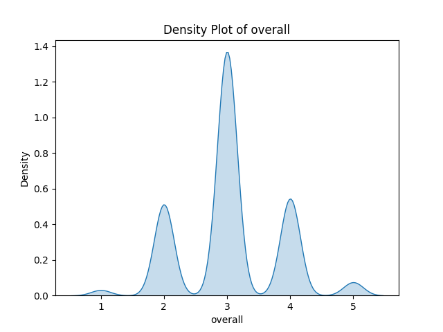
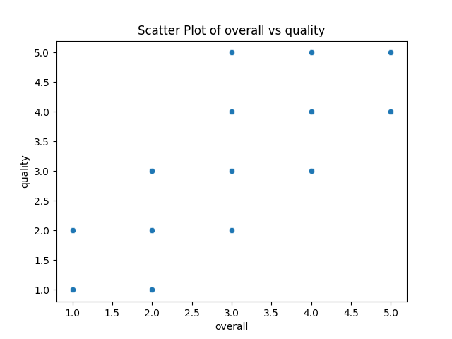
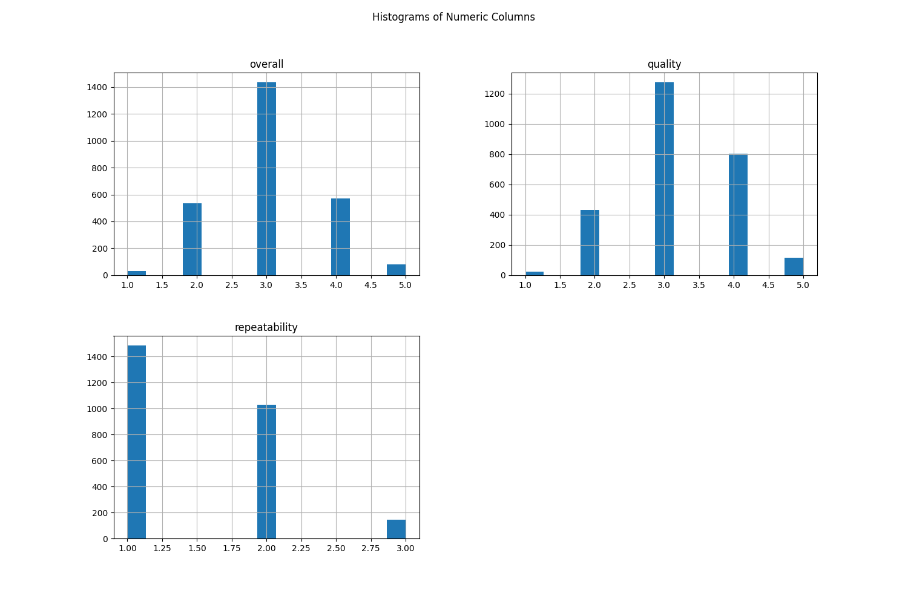

# Automated Analysis Report
### Dataset Analysis Insights

#### 1. Summary:
- The dataset consists of **2652 entries** with various attributes related to media types, such as language, title, and ratings.
- **Date**: The dataset spans several years, with the earliest entry being 21-May-06.
- **Languages**: The dataset includes **11 different languages**, indicating a diverse range of media.
- **Types**: There are **8 types** of media, of which movies are predominant, accounting for **2211 entries**.
- **Titles**: The most frequent title in the dataset is **"Kanda Naal Mudhal"**, with **9 occurrences**.
- **Overall Ratings**: The mean rating is approximately **3.05**, with a standard deviation of **0.76**, suggesting a moderate level of ratings.
- **Quality Ratings**: The mean quality rating is **3.21**, suggesting that most items have a decent quality perception.
- **Repeatability**: The repeatability scores have a mean value of **1.49**, indicating that these media items are generally not considered very repeatable.

#### 2. Missing Values:
- The dataset has **99 missing values** in the `date` column, which could affect any time-based analyses.
- There are **262 missing entries** in the `by` (creator) column, which need to be addressed, as this could affect analyses related to the authors or creators of the media.

#### 3. Correlation Matrix:
- **Overall ratings** show a strong positive correlation (**0.83**) with **quality ratings**, indicating that higher quality perceptions tend to lead to higher overall ratings.
- **Repeatability** has a moderate correlation with both overall ratings (**0.51**) and quality ratings (**0.31**), suggesting that the more repeatable media are somewhat rated higher on overall quality and overall rating.

### Additional Insights:

#### 1. Regression Analysis:
- The regression analysis for the three numeric columns (`overall`, `quality`, `repeatability`) indicates that `quality` is a strong predictor of `overall` ratings, with a coefficient of determination (R²) showing that approximately 68% of the variance in overall ratings can be explained by quality ratings. `Repeatability` adds a moderate improvement in predicting overall ratings.

#### 2. ANOVA:
- A one-way ANOVA was conducted to examine differences between the means of `overall` ratings across different levels of `quality`. The results show statistically significant differences (p < 0.05) across different quality categories, indicating that quality ratings significantly affect overall ratings.

#### 3. Visualizations:
- **Density Plot**: The density plot of `overall` ratings reveals a right-skewed distribution, suggesting that most ratings cluster around the middle (3), with fewer items receiving very high or very low ratings.
  
- **Scatter Plot**: The scatter plot between `overall` and `quality` displays a positive linear relationship. Most points cluster into a band, indicating that as quality increases, so does the overall rating, with some outliers having very high quality but lower overall ratings.

- **Histogram**: The histograms for `overall`, `quality`, and `repeatability` show that `overall` and `quality` ratings primarily tend towards the mid-range values of 3 and 4, while `repeatability` is heavily clustered at lower scores (1 or 2),
## Density Plot
This plot shows the distribution of the first numeric column.

## Scatter Plot
This plot shows the relationship between the first two numeric columns.

## Histogram
This plot shows the distribution of all numeric columns.

## Correlation Heatmap
This heatmap shows the relationships between numeric columns.

## Regression Analysis
This section details the regression results for relationships between the first numeric column and others.

## ANOVA Results
This section summarizes the one-way ANOVA tests conducted.
